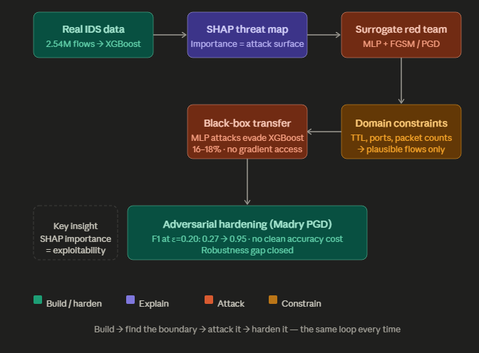
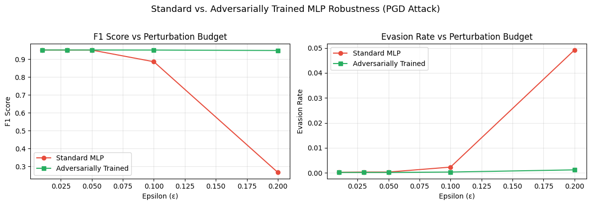
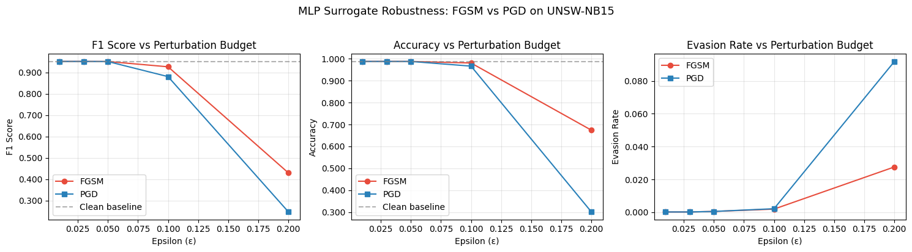
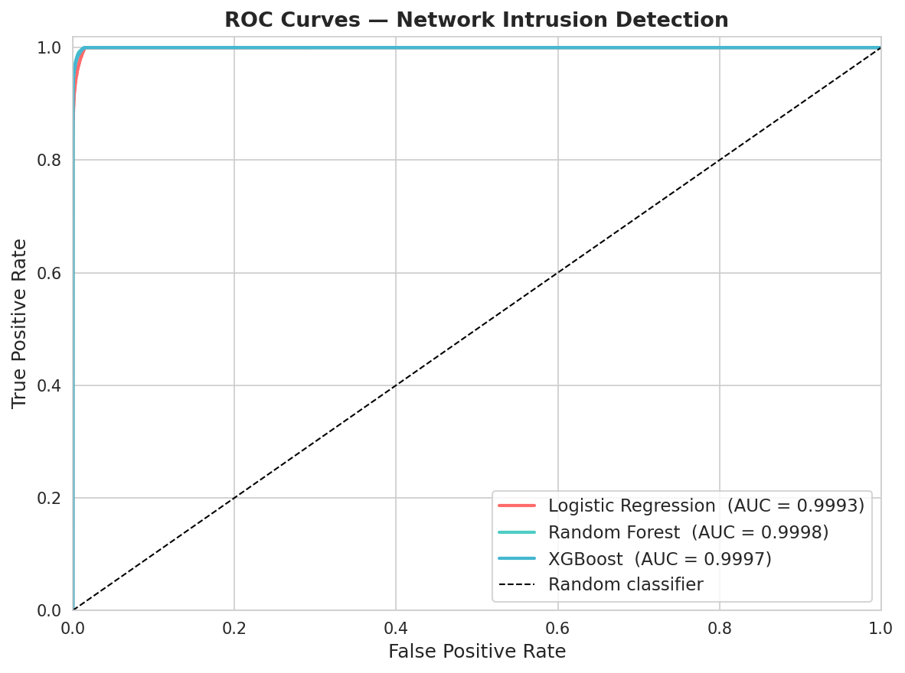
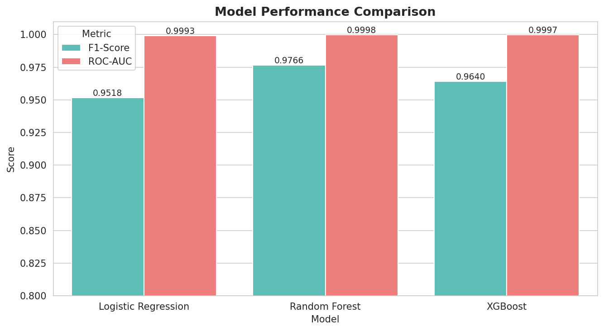
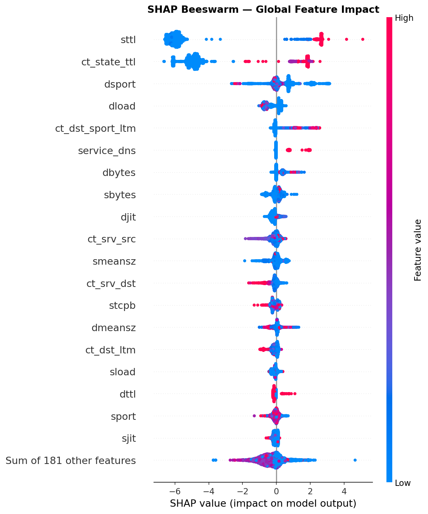
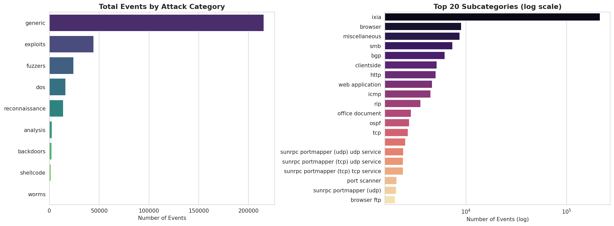

# Network Intrusion Detection — Real IDS Red Teaming & Adversarial Hardening

Real security evaluation of a deployed IDS: apply automated red teaming to the UNSW-NB15 dataset, attack a high-performance XGBoost detector with physically plausible adversarial flows, and harden the system with adversarial training.

Binary classification of network traffic as **normal** or **attack** across 2.54M real network flow records.

Full ML lifecycle: EDA → sklearn Pipeline → XGBoost → SHAP explainability → **automated red teaming → adversarial hardening**.

<p align="center">
  
</p>

*Research workflow: build a real IDS, map the attack surface with SHAP, red-team it with a surrogate, enforce domain constraints, measure transfer, and harden the model.*

**XGBoost baseline: F1 = 0.9640 · ROC-AUC = 0.9997**

---

## Automated Red Teaming & Adversarial Hardening (Notebooks 04–05)

This project extends beyond classification into **operational adversarial ML research**:

1. A differentiable PyTorch MLP surrogate (F1 = 0.9519) is trained on the same preprocessed features
2. A red agent applies FGSM and PGD with **domain-aware constraint projection** — keeping adversarial flows physically plausible (no negative packet counts, TTL ∈ [0,255], port numbers ∈ [0,65535])
3. Evasion rates are measured per MITRE ATT&CK attack category
4. A **black-box transfer attack** shows MLP adversarial examples evade the XGBoost classifier at **16–18%** with no access to target gradients — a 15x increase in false negatives over the clean baseline
5. **Madry PGD adversarial training** hardens the classifier with no clean-accuracy cost

Most published FGSM work on intrusion detection ignores domain constraints, producing physically impossible network flows. This project makes the threat model operationally meaningful by enforcing practical packet, TTL, and port constraints.

### Key Result: Standard Model Collapses — Hardened Model Holds

<p align="center">
  
</p>

| | Clean F1 | F1 at ε=0.10 | F1 at ε=0.20 |
|---|---|---|---|
| Standard MLP | 0.9519 | 0.8865 | **0.2658** |
| Adversarially Trained MLP | 0.9524 | **0.9520** | **0.9494** |

At ε=0.20, the standard model collapses to F1=0.27 (near-random). The hardened model retains F1=0.9494 — **99.7% of clean performance** — with no accuracy-robustness tradeoff on clean data.

### Attack Methodology: FGSM vs PGD

<p align="center">
  
</p>

---

## Classification Results

<p align="center">
  
  
</p>

| Model | F1-Score | ROC-AUC |
|---|---|---|
| Logistic Regression | 0.9518 | 0.9993 |
| Random Forest | 0.9766 | 0.9998 |
| **XGBoost** | **0.9640** | **0.9997** |

---

## Explainability (SHAP)

XGBoost predictions interpreted via SHAP TreeExplainer — the same top features identified by SHAP are the primary targets of the adversarial attacks in notebooks 04–05.

<p align="center">
  
</p>

---

## Dataset

**UNSW-NB15** — captured at the UNSW Canberra Cyber Range. 9 attack categories across 2.54M labeled flows.

<p align="center">
  
</p>

- Source: [Kaggle — mrwellsdavid/unsw-nb15](https://www.kaggle.com/datasets/mrwellsdavid/unsw-nb15)
- 49 features: protocol stats, packet counts, timing, connection flags
- Class split: 87.4% normal / 12.6% attack
- Attack categories: analysis, backdoors, DoS, exploits, fuzzers, generic, reconnaissance, shellcode, worms

---

## Notebooks

| | Notebook | What it covers |
|---|---|---|
| 01 | [EDA & Preprocessing](01_eda_preprocessing.ipynb) | Data loading, attack category analysis, feature distributions, correlation heatmap |
| 02 | [Modeling](02_modeling.ipynb) | sklearn Pipeline, LR / RF / XGBoost, ROC curves, confusion matrices |
| 03 | [Explainability](03_explainability.ipynb) | SHAP TreeExplainer, beeswarm, waterfall, dependence plots |
| **04** | [**Adversarial Attacks**](04_adversarial_attacks.ipynb) | **Red Team attack suite: MLP surrogate, FGSM + PGD with domain constraint projection, per-category evasion, black-box transfer** |
| **05** | [**Adversarial Training**](05_adversarial_training.ipynb) | **Adversarial hardening: Madry PGD, robustness curves, clean vs hardened comparison** |

---

## Setup

```bash
pip install -r requirements.txt
```

Configure Kaggle API — create `~/.kaggle/kaggle.json`:
```json
{"username": "your_username", "key": "your_api_key"}
```
Get your key at [kaggle.com/settings](https://www.kaggle.com/settings) → API → Create New Token, then:
```bash
chmod 600 ~/.kaggle/kaggle.json
```

Run notebooks in order:
```
01_eda_preprocessing  →  02_modeling  →  03_explainability  →  04_adversarial_attacks  →  05_adversarial_training
```

> Notebook 02 uses a stratified 500k-row sample by default. Set `SAMPLE_SIZE = None` for full 2.54M rows.

---

## Project Structure

```
.
├── 01_eda_preprocessing.ipynb
├── 02_modeling.ipynb
├── 03_explainability.ipynb
├── 04_adversarial_attacks.ipynb       ← adversarial attack suite
├── 05_adversarial_training.ipynb      ← adversarial training / hardening
├── src/
│   ├── neural_detector.py             ← PyTorch MLP, training loop, save/load
│   ├── attacks.py                     ← FGSM, PGD, constraint projection
│   └── robustness.py                  ← evaluation metrics, plotting
├── figures/                           ← all result plots (tracked)
├── data/processed/                    ← generated by notebooks (gitignored)
├── models/
│   ├── feature_meta.json              ← feature names and types
│   ├── xgb_model.joblib               ← trained XGBoost pipeline (gitignored)
│   ├── mlp_surrogate.pt               ← generated by notebook 04 (gitignored)
│   └── mlp_hardened.pt                ← generated by notebook 05 (gitignored)
├── generate_notebooks.py              ← regenerates notebooks 01–03
├── generate_adversarial_notebooks.py  ← regenerates notebooks 04–05
└── requirements.txt
```
