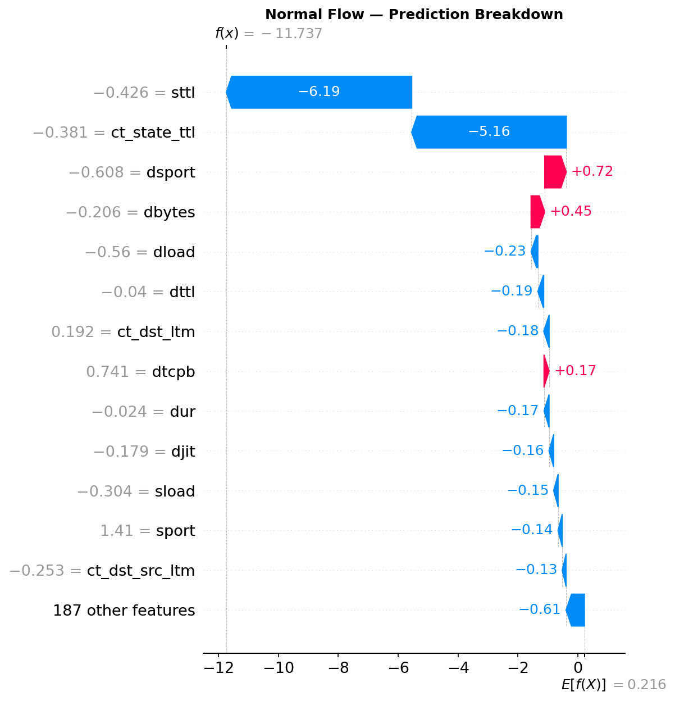
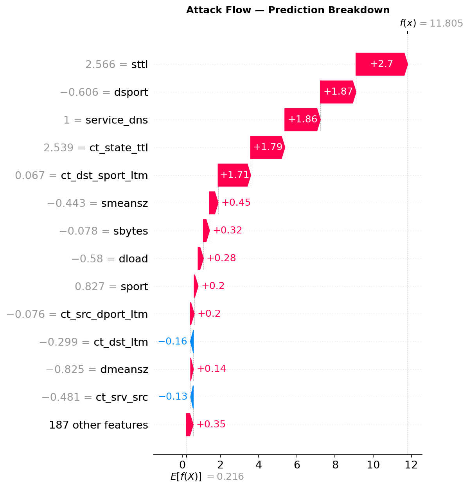

# Network Intrusion Detection — UNSW-NB15

Binary classification of network traffic as **normal** or **attack** across 2.54M real network flow records.
Full ML lifecycle: EDA → sklearn Pipeline → XGBoost → SHAP explainability.

**XGBoost: F1 = 0.9640 · ROC-AUC = 0.9997**

---

## Results

<p align="center">
  
  
</p>

| Model | F1-Score | ROC-AUC |
|---|---|---|
| Logistic Regression | see notebook | see notebook |
| Random Forest | see notebook | see notebook |
| **XGBoost** | **0.9640** | **0.9997** |

---

## Explainability (SHAP)

XGBoost predictions are interpreted using SHAP TreeExplainer — identifying which features drive
each classification decision globally and for individual flows.

<p align="center">
  
</p>

<p align="center">
  
  
</p>

---

## Dataset

**UNSW-NB15** — captured at the UNSW Canberra Cyber Range. 9 attack categories across 2.54M labeled flows.

<p align="center">
  
</p>

- Source: [Kaggle — mrwellsdavid/unsw-nb15](https://www.kaggle.com/datasets/mrwellsdavid/unsw-nb15)
- 49 features: protocol stats, packet counts, timing, connection flags
- Class split: 87.4% normal / 12.6% attack

---

## Notebooks

| | Notebook | What it covers |
|---|---|---|
| 01 | [EDA & Preprocessing](01_eda_preprocessing.ipynb) | Data loading, attack category analysis, feature distributions, correlation heatmap |
| 02 | [Modeling](02_modeling.ipynb) | sklearn Pipeline with imputation, LR / RF / XGBoost, ROC curves, confusion matrices |
| 03 | [Explainability](03_explainability.ipynb) | SHAP TreeExplainer, beeswarm, waterfall plots, dependence plot |

---

## Setup

```bash
pip install -r requirements.txt
```

Configure Kaggle API — create `~/.kaggle/kaggle.json`:
```json
{"username": "your_username", "key": "your_api_key"}
```
Get your key at [kaggle.com/settings](https://www.kaggle.com/settings) → API → Create New Token, then:
```bash
chmod 600 ~/.kaggle/kaggle.json
```

Run notebooks in order:
```
01_eda_preprocessing  →  02_modeling  →  03_explainability
```

> Notebook 02 uses a stratified 500k-row sample by default. Set `SAMPLE_SIZE = None` for full 2.54M rows.

---

## Project Structure

```
.
├── 01_eda_preprocessing.ipynb
├── 02_modeling.ipynb
├── 03_explainability.ipynb
├── figures/                  # plots generated by the notebooks
├── requirements.txt
├── data/                     # gitignored — generated by notebook 01
└── models/                   # gitignored — generated by notebook 02
```
